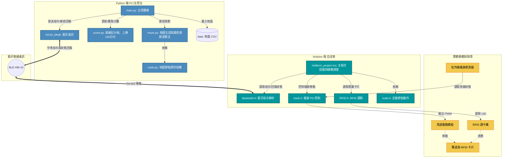

# 指定題 Documentation

# 1. 專案基本資料

- **專案名稱**：自走車循跡與迷宮尋寶系統
- **專案連結：** https://github.com/Physicsphotonmodel/Midterm_codes
- **組員名稱與分工**：
    
    
    | 姓名 | 工作範圍 |
    | --- | --- |
    | 曾竹慧 |  Arduino-tracking, node behavior, main loop mechanism / Bluetooth communication between car and PC (aka 逐點傳輸) / Integrate code / Adjust hardware(buck, battery, TB6612, HM10) |
    | 劉欣琪 |  Algorithm BFS (in maze.py) / Arduino-handle RFID / Adjust hardware(motor, buck, main structure) |
    | 梁勝宥 | python-score, main operation logic / Adjust hardware(motor, main structure, TB6612) |
- **開發期間**：2026年3月 - 2026年4月
- **最後更新日期**：2026年4月29日

## 2. 專案簡介

### 2.1 專案概述

本專案開發一套自走車系統。車體使用 Arduino Mega 2560 執行即時的馬達控制與感測器讀取；PC 端使用 Python 執行路徑規劃。雙方透過 HM-10 藍牙模組進行低延遲通訊，完成迷宮探索與 RFID 寶藏點讀取任務。

### 2.2 專案目標

1. 解決 Orienteering Problem：在 65 秒的嚴格時間限制內，最大化地圖上收集到的寶藏總積分。
2. 實現高穩定度的循跡：維持車子不脫軌並具備自主循跡能力。

## 3. 系統架構與設計

### 3.1 系統架構圖



### 3.2 架構說明

#### 3.2.1. Python 端

負責地圖管理、路徑搜尋演算法，以及比賽計分邏輯。

- **`main.py` (主控)**：系統運行的核心中樞。負責協調各模組，包含載入地圖資料、請求路徑規劃、統整計分，並透過藍牙模組派發動作指令給自走車。
- **`maze.py` (路徑規劃)**：演算法核心。讀取地圖資訊後，運算並生成最優路徑指令。
- **`node.py` (節點結構)**：定義地圖網格中單一節點 (Node) 的基本資料結構，供演算法使用。
- **`score.py` (連線記分板)**：管理比賽計分狀態。當接收到車體回傳的寶藏卡片 UID 時，負責將資料上傳並更新分數。
- **`hm10_bleak` (藍牙通訊)**：使用 Bleak 套件處理 PC 端的藍牙通訊，負責發送字串指令與接收車體狀態回報。
- **`data` (地圖資料庫)**：存放 CSV 檔案。

#### 3.2.2. Arduino 端

感測器讀取、PD 修正，以及實體硬體調度。

- **`midterm_project.ino` (主程式與調度)**：Arduino 的主迴圈 (loop)。負責監聽藍牙指令，並即時調度對應的硬體動作。
- **`bluetooth.h` (指令解析)**：透過硬體序列埠 (`Serial3`) 接收並解析來自 HM-10 的字串指令，同時負責將執行結果回報給 PC。
- **`track.h` (循跡 PD 控制)**：移動控制核心。即時讀取紅外線陣列狀態，透過 PD (Proportional-Derivative) 控制演算法動態調整左右馬達的 PWM 輸出，確保穩定循跡。
- **`RFID.h` (讀卡控制)**：負責操作底層的 RFID 模組，於特定節點讀取寶藏卡片的 UID。
- **`node.h` (節點動作定義)**：定義車子在抵達地圖節點時，所需執行的實體動作細節與狀態。

#### 3.2.3. 實體硬體與環境 (Hardware)

- TT馬達*2：車子動力來源
- TB6612模組*1：控制兩顆馬達的馬力跟轉向
- IR紅外線感測器*5：辨別是否在黑線上行駛
- MFRC522*1：讀取RFID並供Arduino回傳給PC
- 降壓模組(buck)*1：確保主要電路不被12.6V鋰電池高電壓損壞
- Arduino Mega*1：運算中心
- CarCarShield(PCB)*1：方便模組擺放，簡化接線
- BLE HM-10 模組：作為 PC 與 Arduino 之間的橋樑，負責雙向字串傳輸（包含 PC 發送的動作指令，以及車體回傳的狀態與 UID）
- 鋰電池：電力來源，兼具車子配重功能

#### 3.2.4. 核心資料傳遞流程 (Workflow)

1. **PC 決策**：`main.py` 透過 `maze.py` 規劃路徑，轉換為字串指令後，經由 `hm10_bleak` 發送。
2. **車體執行**：Arduino 的 `bluetooth.h` 由 `Serial3` 收到指令，觸發 `track.h` 開始 PD 循跡。
3. **節點處理**：抵達十字路口或目標節點時，車體往前滑行等待下個指令，可以避免停頓造成的時間耗損。若為寶藏點，則透過 `RFID.h` 讀取實體卡片感應 UID。
4. **狀態回報與計分**：Arduino 透過藍牙將抵達節點的 acknowledge 或 UID 回報給 PC；PC 接收後觸發 `score.py` 上傳計分，並派發下一步指令。

## 4. 專案功能特點（Features）

- **1. Client-Server Architecture**
    - 將高複雜度的 Path Planning 交由 PC 端執行。
    - Arduino 專注於 Low-latency 的 Sensor 讀取與 Motor Control。
    - 有效解決 Microcontroller 運算資源與 Memory 受限的問題。
- **2. Global Optimal Path Planning**
    - 演算法內建真實車體的 Time Cost Model（如直行耗時 0.92s、轉彎耗時 0.34s 等）。
    - 系統利用 Graph Search Algorithms（BFS）在嚴格的 Time Limit 內，計算並優化出具備最高 Score 的 Optimal Path。
- **3. High-Stability PD Tracking**
    - Arduino 透過讀取 IR Sensor來判斷賽道顏色。
    - 底層利用 Proportional-Derivative (PD) Controller 計算 Error，並動態調整左右 Motor 的 PWM 輸出。
    - 演算法內建 Line-loss Recovery 機制，能有效抑制高速行駛時產生的 Overshoot 與震盪。
- **4. Asynchronous BLE Communication**
    - PC 端採用 `bleak` 套件進行 Asynchronous I/O 連線。
    - 系統與車載 HM-10 模組之間傳遞 Lightweight Commands（例如 `f`, `l`, `h`）以降低延遲。
    - 通訊機制採 Event-driven，車體平時自主循跡，僅在 Node Reached 或觸發感測器時回報中斷訊號。
- **5. RFID Scoring System (RFID 計分系統)**
    - 車體抵達特定 Node，MFRC522 模組掃描地面的 RFID UID。
    - 讀取到的 UID 透過藍牙回傳 PC，PC 端再藉由 Socket.IO 即時將資料上傳至 Scoreboard Server 進行驗證與計分，完成尋寶流程。
- **6. Modular & Scalable Codebase**
    - Python 端將 Graph Routing (`maze.py`)、API 互動 (`score.py`) 與通訊層解耦。
    - Arduino 端則將 Motor Control (`track.h`)、藍芽 (`bluetooth.h`) 與感測器層 (`RFID.h`) 分離，大幅提升系統未來的 Maintainability 與 Scalability。

## 5. 功能組件說明

### 5.1 Python Path Planning Module (`maze.py`)

- **What**：負責解析 CSV 建立 Node Graph，並計算時間限制內的最佳 Action Sequence。
- **Why**：Microcontroller 缺乏足夠的 Memory 與 Compute Power 處理全域節點預測與 Time Cost 浮點運算。
- **How**：
    - BFS 尋找兩個節點之間的最短路徑
    - Greedy Algorithm 計算未來三步的總體效益（前 29 秒）
        - 效益計算( CP 值)：total score / total time cost
        - 使用 _estimate_time_cost 的函式，累加車子直行、轉彎以及迴轉的時間
        - 剪枝：在搜尋過程中，程式會不斷檢查 time_spent + time_t <= time_limit，如果模擬到一半發現時間不夠，會立刻放棄此分支，避免無效計算
    - Greegy Algorithm 計算單點（最後 36 秒）
        - 找目前能到的寶藏點中，吃最近的分數

### 5.2 Python Master Control & Bluetooth (`main.py` & `hm10_bleak`)

- **What**：系統的中樞。管理非同步連線與 Event-driven 指令派發。
- **Why**：2.4GHz 頻段干擾嚴重，傳統 Blocking I/O 的藍牙讀取易導致 Thread 卡死或封包遺失。
- **How**：採用 `asyncio` 協程與 `bleak` 實作 Asynchronous I/O。主迴圈持續監聽車體的 Event 訊號（如 `K` 節點抵達、`ID` RFID 掃描），僅在 Event 觸發時才發送預先算好的 String Command（`f`, `l`, `r`, `b`），確保通訊無阻塞。

### 5.3 Python Scoreboard API (`score.py`)

- **What**：比賽計分介面。處理 UID 驗證與 Socket 通訊。
- **Why**：需自動化、低延遲地將實體卡片 UID 傳送至server以獲取積分。
- **How**：利用 `socketio` 建立 WebSocket 連線。接收到藍牙端傳來的 Hex String 後，向 `/team` Namespace 發送 Request 並解析回傳的 Score 與 Remaining Time，達成即時狀態同步。

### 5.4 Arduino Main Loop & Dispatcher (`midterm_project.ino` & `bluetooth.h`)

- **What**：車載端的 Task Dispatcher。負責封包解析與軟硬體中斷排程。
- **Why**：需靈敏地在 Line Tracking 與 Node Action 之間切換。
- **How**：
    - `bluetooth.h` 透過硬體 `Serial3` 解析字元並 Mapping 至 `BT_CMD` Enum。
    - 主迴圈持續檢查 IR Sensor Array。偵測到全黑 (`l3 && r3`) 時，先轉為前進 (`MotorWriting(255, 255)`) 並回傳 `K` 訊號，進入 Blocking Wait 等待 PC 的下一個 Routing Command 才放行。

### 5.5 Tracking (`track.h`)

- **What**：Closed-loop Line Tracking Controller，即時調節左右馬達 PWM。
- **Why**：為最大化分數，採用 `Tp = 255` 的極限基礎動力，但高電壓易放大 Tracking Error，產生嚴重的 S-curve Oscillation (高頻抽搐) 或脫軌。
- **How**：
    - **Weighted Error**：依據 $Error = \frac{\sum (IR_i \times W_i)}{\sum IR_i}$ 計算偏移量。
    - **PD Control**：實作 Proportional-Derivative 控制 (`Kp=10`, `Kd=5`) 輸出 `powerCorrection`，利用 Damping 抑制晃動。
    - **Boundary Clamping**：嚴格限制 PWM $\ge 0$，禁止高速時單輪反轉，迫使車體以平順的 Differential Gliding (差速滑行) 修正軌跡。
    - **Line-loss Recovery**：當 $\sum IR_i = 0$ 時，讀取靜態變數 `lastError` 判定出軌前趨勢，施加單輪煞車 (`MotorWriting(150, 0)`) 利用剩餘慣性將車頭掃掠回軌道。

### 5.6 Arduino Node Turning (`node.h`)

- **What**：負責路口轉向 (Right / Left / U-turn) 與直角跨越的硬體驅動邏輯。
- **Why**：傳統依賴特定 Sensor 踩黑線即轉的邏輯，在 T-junction 或 L-junction 易誤判導致原地死迴圈。
- **How**：實作 **Hybrid Blind-Turn Mechanism (混合式盲轉機制)**。
    1. **Clearance (離開中心)**：持續直推，直到確認 Sensor 離開原軌跡 (`l3*l2*m*r2*r3 == 1` 條件解除)。
    2. **Blind Push (延遲盲推)**：給定雙輪 Differential Drive (`MotorWriting(slow, -slow)`) 與固定時長 `delay(125)`，強制車頭甩動脫離舊黑線。
    3. **Dynamic Capture (動態捕捉)**：進入 `while` 迴圈持續自旋，直到外側 Sensor (`r3` 或 `l3`) 重新觸發為 `1` 時才中斷，完美對齊新軌跡並交還給 `track.h`。

### 5.7 Arduino RFID Module (`RFID.h`)

- **What**：MFRC522 UID 擷取層。
- **Why**：車體抵達寶藏 Node 的暫停時間極短，需精確濾除 SPI 雜訊並完成讀卡。
- **How**：透過 `PICC_IsNewCardPresent()` 觸發。獲取 UID Byte Array 後，轉換為大寫 Hex String 格式（前綴加 `ID`，如 `ID10BA617E`），寫入 `Serial3` 傳輸給 PC 處理後續 API 流程。

## 6. 專案資料夾結構

```jsx
📂 Midterm-code/
├── 📁 arduino/
│   └── 📁 midterm_project/
│       ├── 📄 midterm_project.ino  # 主程式
│       ├── 📄 bluetooth.h          # 藍牙
│       ├── 📄 track.h              # IR 感測器讀取與 PD 馬達平滑控制
│       ├── 📄 node.h               # 三段式轉彎與路口穿越邏輯
│       └── 📄 RFID.h               # MFRC522 卡片 UID 讀取
│
├── 📁 python/
│   ├── 📁 data/                  # 地圖資料庫
│   │   ├── 📄 medium_maze.csv     # 測試地圖資料
│   │   ├── ...
│   │   └── 📄 big_maze_114.csv     # 正式競賽地圖資料
│   │
│   ├── 📁 hm10_bleak/            # Asynchronous BLE
│   │   └── 📄 ...
│   │
│   ├── 📄 main.py                # 主控中樞：指令派發
│   ├── 📄 maze.py                # 演算法核心：BFS 與路徑搜索
│   ├── 📄 node.py                # 資料結構：地圖節點定義與座標對應
│   ├── 📄 score.py               # 計分系統：UID 驗證與 Socket API 上傳
│   └── 📄 requirements.txt       # Python 套件清單 (pandas, socketio 等)
│
└── 📄 README.md                  # 環境設定與啟動說明
```

## 7. 開發環境與工具

- **硬體**：Arduino Mega 2560, TB6612FNG, TCRT5000, HM-10 BLE, MFRC522, 馬達。
- **軟體**：Python 3.12 (Conda), Arduino IDE。
- **關鍵套件**：`bleak` (非同步藍牙), `python-socketio` (WebSocket 成績同步), `pandas` (地圖資料載入)。

## 8. 安裝與執行說明

### 8.1 安裝步驟

1. git clone repo (https://github.com/Physicsphotonmodel/Midterm_codes)
2. 使用 Arduino IDE 燒錄 `/arduino/midterm_project.ino`。
3. 開啟 Conda 環境並執行 `pip install -r requirements.txt`。
    
    ```bash
    conda create -n car python=3.12
    conda activate car
    cd python
    pip install -r requirements.txt
    pip install bleak
    ```
    
4. 在python/data裡放.csv檔

### 8.2 執行範例

確保 Windows 藍牙已開啟且未配對 HM-10，執行main.py，mode 0代表正式比賽

1. --dir (車子一開始在起點面對的方向，1234分別是北南西東)
2. --maze-file “XXX.csv”
3. --bt-port “COMX”
4. --team-name “隊名”
5. --server-url “server網址”
6. --async def main → -- my_start_index = 起點編號

```bash
python main.py 0 --dir 2 --maze-file "data/big_maze_114.csv"
```

- 範例log及說明
    
    ```bash
    PS D:\carcar\Week-6-new-codes\midterm-project\python> python main.py 0 --dir 2 --maze-file "data/big_maze_114.csv"
    # 開始規劃路徑
    2026-04-29 15:15:50,572 - maze - INFO - Detecting treasure nodes: [1, 6, 7, 12, 19, 24, 25, 30, 31, 36, 43, 45, 48]
    2026-04-29 15:15:50,661 - maze - INFO - Target: 45 | Remaining: 64.7 | Score: 150
    2026-04-29 15:15:50,730 - maze - INFO - Target: 43 | Remaining: 62.2 | Score: 240
    2026-04-29 15:15:50,783 - maze - INFO - Target: 48 | Remaining: 53.7 | Score: 480
    2026-04-29 15:15:50,824 - maze - INFO - Target: 36 | Remaining: 48.3 | Score: 660
    2026-04-29 15:15:50,850 - maze - INFO - Target: 30 | Remaining: 40.2 | Score: 810
    2026-04-29 15:15:50,851 - maze - INFO - Final 40.2s!!
    2026-04-29 15:15:50,851 - maze - INFO - Target: 12 | Remaining: 31.4 | Score: 1050
    2026-04-29 15:15:50,851 - maze - INFO - Final 31.4s!!
    2026-04-29 15:15:50,852 - maze - INFO - Target: 24 | Remaining: 28.9 | Score: 1230
    2026-04-29 15:15:50,852 - maze - INFO - Final 28.9s!!
    2026-04-29 15:15:50,853 - maze - INFO - Target: 6 | Remaining: 17.5 | Score: 1500
    2026-04-29 15:15:50,853 - maze - INFO - Final 17.5s!!
    2026-04-29 15:15:50,853 - maze - INFO - Target: 1 | Remaining: 9.0 | Score: 1620
    2026-04-29 15:15:50,854 - maze - INFO - Final 9.0s!!
    2026-04-29 15:15:50,854 - maze - INFO - Target: 19 | Remaining: 1.2 | Score: 1650
    2026-04-29 15:15:50,854 - maze - INFO - Final 1.2s!!
    2026-04-29 15:15:50,854 - maze - INFO - Stop planning.
    # 路徑計算完成
    2026-04-29 15:15:50,855 - maze - INFO - Generated Command String: frfflbfblrffrlbrrlbrfrfrfbfrrlrlbfbllrrfrlrbflrrlfbfrffrf
    # 嘗試連接HM10
    2026-04-29 15:15:50,855 - __main__ - INFO - Searching for and connecting to HM10_7 via Bleak...
    Scanning for HM10_7...
    ✅ Connected to HM10_7
    2026-04-29 15:15:53,625 - scoreboard - INFO - WED7 initialized.
    # 連server
    2026-04-29 15:15:53,625 - scoreboard - INFO - Connecting to server: http://carcar.ntuee.org/scoreboard
    2026-04-29 15:15:54,252 - scoreboard - INFO - Connected with SID: MC98VryoDjvFH0HVACpd
    2026-04-29 15:15:54,253 - scoreboard - INFO - Starting game sequence...
    # 確定開始計時
    2026-04-29 15:15:54,627 - scoreboard - INFO - Game started! Playing game as WED7
    # 確定車子好了
    2026-04-29 15:15:54,732 - __main__ - INFO - Received READY signal. Sending START command ('s')...
    # 啟動
    2026-04-29 15:15:54,773 - __main__ - INFO - Vehicle started.
    2026-04-29 15:15:54,774 - __main__ - INFO - Mode 0: Treasure-hunting mode activated.
    2026-04-29 15:15:54,838 - __main__ - INFO - RAW RX: 'K\r\n'
    2026-04-29 15:15:54,838 - __main__ - INFO - Vehicle arrived at node (K). Preparing next action...
    # 發第一個cmd
    2026-04-29 15:15:54,866 - __main__ - INFO - Dispatched command: f
    # 方便除錯直接把封包印出來，這邊代表車完成一個節點直走
    2026-04-29 15:15:54,972 - __main__ - INFO - RAW RX: 'F\r\n'
    2026-04-29 15:15:54,973 - __main__ - INFO - Action completed (F). Resuming tracking...
    # 遇到節點
    2026-04-29 15:15:55,821 - __main__ - INFO - RAW RX: 'K\r\n'
    2026-04-29 15:15:55,822 - __main__ - INFO - Vehicle arrived at node (K). Preparing next action...
    # 在這個節點右轉
    2026-04-29 15:15:55,846 - __main__ - INFO - Dispatched command: r
    2026-04-29 15:15:56,463 - __main__ - INFO - RAW RX: 'R\r\n'
    2026-04-29 15:15:56,463 - __main__ - INFO - Action completed (R). Resuming tracking...
    2026-04-29 15:15:57,217 - __main__ - INFO - RAW RX: 'K\r\n'
    2026-04-29 15:15:57,217 - __main__ - INFO - Vehicle arrived at node (K). Preparing next action...
    ...
    # 掃到RFID
    2026-04-29 15:16:01,227 - __main__ - INFO - RAW RX: 'ID73629231\r\n'
    2026-04-29 15:16:01,228 - __main__ - INFO - Card ID: 73629231
    # 傳上去server
    2026-04-29 15:16:01,676 - scoreboard - INFO - Added UID 73629231 for 150 points with 58.0 seconds remaining
    
    ```
    

## 9. 效能測試與功能驗證

### 9.1 演算法

- 目標：計算在65秒內的最佳路徑並可以生成cmd string
- 效能與功能驗證：
    - 1秒內跑完48個點的路徑規劃，詳見8.2執行範例
    - 可生出cmd string
    - 人工確認路徑無明顯謬誤

### 9.2 藍芽

- 目標：可以讓cmd、ack、UID在Arduino跟PC間傳遞並且沒有漏包
- 效能與功能驗證：
    - 傳輸順暢，不易因干擾漏包
    - PC及Arduino都可以收到完整的命令(f，l，r，b)
    - UID加padding後可以完整傳輸

### 9.3 RFID&記分板

- 目標：到節點後上傳該節點的UID以獲得分數
- 效能與功能驗證：
    - 可連上計分板並顯示隊名
        
        
        
    - 可在計分板上看到隊名跟分數更新可掃描UID後上傳計分板，看到計分板分數改變，並獲得計分板回傳訊息
    - PC可以正常跟記分板連線

### 9.4 循跡

- 目標：車子可以沿著黑線穩定行走
- 效能與功能驗證：
    - 可透過IR讀值明顯分別黑線跟空白區塊
    - PD control在維持車子循跡上足夠穩定，轉彎回到黑線也能繼續循跡
    - 在起點故意放歪車子可以自動校正回來且不會大幅擺動
    - 參數從小調到大，每次上下增加1~2，並在Tp=255，Kp、Kd比例1:1~4:1之間調整參數，以錄影紀錄車子行走狀況並與先前參數比較，最後在Kp=10，Kd=5時表現最好
    - 降壓9V時測試
        
        
        | Tp | Kp:Kd 比例 | Kp:Kd 實值 | 效果 |
        | --- | --- | --- | --- |
        | 170 | 1:1&only P | 40:40&40:0 | 非常不穩定的循跡，有出軌 |
        | 170 | only D&1:20 | 0:40&2:40 | 較穩定，但行走時偶會卡頓 |
        | 170 | 2:1 | 24:12 | 非常不穩定的循跡，有出軌 |
        | 170 | 1:2 | 6:12 | 非常不穩定的循跡，勉強沒有出軌 |
        | 170 | 1:3、1:3.5、1:4 | 4:12、4:14、3:12 | 不穩定的循跡，車頭常搖晃 |
        | 170 | 1:3 | 8:24 | 不穩定的循跡，車頭常大幅搖晃 |
        | 170 | 1:3 | 2:6 | 非常不穩定的循跡，勉強沒有出軌 |
        | 170 | 1:1 | 1:1 | 直走很順，起始略偏的話會開始歪，HM10無法收封包，但可以發 |
        | 255 | 1:1 | 1:1 | 成鋸齒型路線 |
        | 255 | 2:1 | 10:5 | 成鋸齒型路線 |

## 10. 遇到的挑戰、對應的解方以及未來改進方向

### 10.1 挑戰與解方紀錄

- 極速循跡時的高頻震盪 (抽搐)
    - 原因：當 Tp=255 且 Kp=40 時，輕微偏移會產生巨大的修正值，導致內側車輪瞬間出現負值輸出，在極速下強制倒轉會將車頭甩出黑線。
    - 解方：於 `track.h` 中將 Kp 降至 10，並加入 `if (vR < 0) vR = 0;` 邏輯，強制制止高速下的倒車，改以單輪失去動力滑行的方式柔和修正。
- HM10 可以發 READY 卻不能收 cmd
    - 原因：吃 Mega 3.3V 似乎不夠，疑似 Mega 供電品質問題
    - 解方：
        - 直接接線到 5V →沒用
        - TB6612 大改造（詳參下方馬達）之後運作正常，但馬達速度太快
        - 降壓模組 5V 剛好夠，只是有大約 20 ~ 30% 機率需要兩次才連得上電腦，需要下電、電腦重開藍芽會比較連得上
- 馬達動力不足
    - 原因：為了讓 HM10 連得上電腦把降壓模組調到 5V，馬達供電小
    - 解方：
        - 曾嘗試剪斷 TB6612 $V_M$腳位，直接焊電線到電池，速度太快不穩定，最後未採用
        - 電池有一顆損壞，更換後供電恢復穩定
        - 換了 3 次馬達，第一次發的馬達轉速本身就偏慢，測速度的方法不宜用目測，因此把手機碼錶跟黏了膠帶的馬達一起錄影，計算繞一圈耗時，挑速度最快且相近的馬達
- 迴轉回來總是偏離正中央的黑線
    - 原因：在 `vR = vL` 時，迴轉時兩輪轉速並非剛好一正一負相反，左輪向後的速度一直比右輪向前的速度慢
    - 解方：將 vL 調大，讓車子盡可能以中心軸迴轉
- 走到 node 一直卡頓
    - 原因：原本 Arduino 迴圈有 `MotorWriting(0,0)` 導致每到一個 node 就停
    - 解方：改成繼續前進 `MotorWriting(255,255)` ，比賽當天為了穩定降速到 100
- 會先連 server 再連藍芽，65 秒的計時不是在開始跑的時候計算的
    - 原因：`main.py` 寫錯順序
    - 解方：顛倒一下順序
- RFID 最後一位被吃掉
    - 原因：藍芽傳輸的不穩定性
    - 解方：加 padding 0
- 死巷看到 node 再迴轉時間耗費過大
    - 原因：看到 RFID 就可以轉彎
    - 解方：改成傳 UID 回去順便轉彎，PC 端跳過 b 指令，但最後比賽因為不夠穩定捨棄
- 演算法搜出來的路徑和我們理想上的路徑有偏差
    - 原因：一次只考慮單點的分數 cp 值，易忽略第一個點 cp 值低，但組合第二個點後 cp 值反而比較高的路徑
    - 解方：改成一次看三個點的組合 cp 值來決定寶藏點的抵達順序
- 演算法規劃的路徑只讓車子跑 55 ~ 60 秒，剩餘時間不夠跑到下個組合 cp 值最高的節點就停止規劃
    - 原因：
        - 原本的演算法只看組合 cp 值而已
        - 原本演算法中只設定 `time_limit = 60`
    - 解方：
        - 在剩餘秒數不足以走到下個 cp 值最大的點，改成找最近的寶藏點，也就是找抵達耗時最短的寶藏點
        - 在演算法中設定 `time_limit = 70` ，讓演算法多規劃一個點走
        - 比賽當天，為了確保可以吃到足夠多的分數，最後設定演算法在某一點過後都只找最近的點吃，避免車子來回走浪費時間
- 比賽當天車子突然不按 cmd string 執行
    - 原因：
        - 網路不佳，PC 卡死在 upload UID，沒有傳下一個 cmd 過去
        - 十分鐘內沒解決這個問題且之前逐點傳輸沒有寫一次傳兩個導致車子遇到 RFID 就開始失控
    - 解方：
        - 在中場維修換一台電腦又換一個網路
        - 把 RFID 迴轉刪掉，這樣至少碰到 node 迴轉的時間足夠填補 upload 時間差
        - 降低 node 上行走速度，犧牲時間換取穩定性

### 10.2 未來改進方向

1. 動態 Kp 控制：目前採用固定 Kp、Kd，未來可研究是否可以改進原本在車體實作不穩的 PID 或依照直道與彎道距離動態切換 Tp 與 Kp 參數。
2. Scoreboard 跟藍芽應該要做成asynchronous，才可以避免賽中發生傳不上計分板造成blocking的狀況
3. 希望加大電壓到9V，調Kp、Kd參數使車速變快但仍然穩定
4. 可以疊加額外的功能例如聲控或影像辨識（往特定物品方向前進，或循跡線不只一個顏色）
